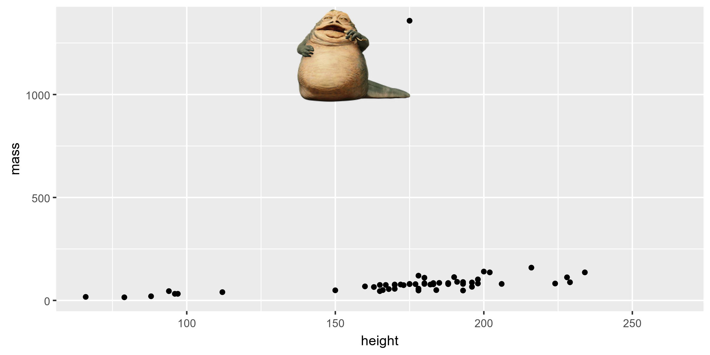

```{r, include = FALSE}
knitr::opts_chunk$set(
  echo = TRUE,
  dpi = 300,
  message = FALSE,
  warning = FALSE
)
library(dplyr)
library(magick)
```


## Catch up

- Any questions on material from last time?

- Any questions on the reading / primer?

- Any questions on workflow / course structure?
    
- Catch up on informal "requirements":

    + You should have a GitHub profile.
    
    + You should have an RStudio cloud profile. 
    
    + Ideally add your photo to both profiles.

---

## Agenda

- Tips on getting help (`reprex`)

- Exploratory data analysis

- Data visualization

- Visualizing Star Wars

- Aesthetics

- Faceting

---

class: inverse, center, middle

# `reprex`

---

## What is `reprex`? 

`reprex` stands for reproducible example. The `reprex` [R package](https://reprex.tidyverse.org/) helps you prepare reproducible examples for posts on GitHub, StackOverflow, or Slack. 

--

.pull-left[

- If you want someone to help you solve a problem...

- widdle the problem down to its essential components.

- keep code minimal, don't overwhelm your helpers.

- describe issues concisely.

]

--

.pull-right[
```{r, echo=FALSE, out.width=500, out.height=300}
knitr::include_graphics('img/help-me-help-you.gif')
```
]

.footnote[</br>Image source and great place to get help: [https://reprex.tidyverse.org/](https://reprex.tidyverse.org/) </br> see R/reprex_example in [Rstudio cloud](https://rstudio.cloud/spaces/15174/project/1048666)]

---


class: center, middle

# Exploratory data analysis </br> (EDA)

---

## What is EDA?

- Interactively learning about data by summarizing its main characteristics.

--

- Often, this is visual. That's what we'll focus on today.

--

- We might also calculate summary statistics and perform

    + data tidying (coming up much later)
    
    + data isolation (coming up next time)
    
    + data transformation (coming up later)
    

at (or before) this stage of the analysis. 

---

class: center, middle

# Data visualization

---

## Data visualization

> *"The simple graph has brought more information to the data analyst’s mind than any other device." — John Tukey*

- Data visualization is the creation and study of the visual representation of data.

- There are many tools for visualizing data (R is one of them), and many approaches/systems within R for making data visualizations (**ggplot2** is one of them, and that's the one we're going to use).

---

## `ggplot2`

- `ggplot2` is a data visualization package. Like any package, `ggplot2` should be loaded before its functions are used.

```{r, message = FALSE, warning = FALSE}
library(ggplot2)
```

--

- Code for `ggplot` can often be written as
```{r eval = FALSE}
ggplot + geom_yyy()
```

--

- More generally:
```{r eval = FALSE}

ggplot(data = [dataset]) +
  aes(x = [x-variable], y = [y-variable]) +
  geom_xxx() +
  other_functions()

```

- `geoms` (geometric objects) determine the type of plot produced.

---

## About `ggplot2`

- `ggplot2` is the name of the package

- The `gg` in "`ggplot2`" stands for Grammar of Graphics

- Inspired by the book **Grammar of Graphics** by Leland Wilkinson

- `ggplot()` is the main function in ggplot2

- For help with `ggplot2`, see http://ggplot2.tidyverse.org/

---

class: center, middle

# Visualizing Star Wars

---

## Dataset terminology


__Question__: What does each row represent? What does each column represent?


```{r}
starwars[, 1:5]
```

---

## Luke Skywalker


---

## What's in the Star Wars data?

Take a `glimpse` at the data: 
```{r}
glimpse(starwars, width = 60)
```

---

## What's in the Star Wars data?

Run the following **in the Console** to view the help
```{r eval = FALSE}
?starwars
```


__Question__: How many rows and columns does this dataset have? 

Make a prediction: What relationship do you expect to see between height and mass?

---

## Mass vs. height

```{r fig.width = 6, fig.height=3, warning = TRUE, message = TRUE}
ggplot(data = starwars) +
  aes(x = height, y = mass) +
  geom_point()
```

---

## What's that warning?

- Not all characters have height and mass information (hence 28 of them not plotted)

```
## Warning: Removed 28 rows containing missing values (geom_point).
```

- Going forward I'll supress the warning to save room on slides, but it's important to note it

---

## Mass vs. height


__Questions__: 
- How would you describe this relationship?
- Who is the not so tall but really chubby character?


```{r fig.width = 6, fig.height=3, echo=FALSE, warning=FALSE}
ggplot(data = starwars, mapping = aes(x = height, y = mass)) +
  geom_point()
```

---
class: center, middle
# Jabba!

```{r echo=FALSE, warning=FALSE, message=FALSE, include = FALSE}
jabba <- image_read("img/jabba.png")

fig <- image_graph(width = 2400, height = 1200, res = 300)
ggplot(data = starwars, mapping = aes(x = height, y = mass)) +
  geom_point()
dev.off()

out <- fig %>% image_composite(jabba, offset = "+1000+30")

image_write(out, "img/jabbaplot.png", format = "png")
```

```{r echo = FALSE}

```


---
class: center, middle

# Aesthetics

---

## Aesthetics options

Visual characteristics that can be **mapped to data** are

- `color`

- `size`

- `shape`

- `alpha` (transparency)

---

## Mass vs. height + gender

```{r fig.width = 7, fig.height=3.5, warning=FALSE}
ggplot(data = starwars) + 
  aes(x = height, y = mass, color = gender) +
  geom_point()
```

---

## Aesthetics summary

- Discrete variables are measured (often counted) on a discrete scale

```{r, echo = FALSE}

df <- tibble::tibble(
  Aesthetics = c("color", "size", "shape"),
  Discrete = c(
    "different color for each category", 
    "discrete steps in sizes", 
    "different shapes for each category"
  ),
  Continuous = c(
    "color gradient",
    "linear mapping between radius and value",
    "shouldn't (and doesn't) work"
  )
)

library(magrittr)

gt::gt(df[, c(1,2)], rowname_col = 'Aesthetics') %>% 
  gt::tab_stubhead('Aesthetics') %>% 
  gt::cols_align('center') %>% 
  gt::tab_options(table.width = gt::pct(100))

```

- Continuous variable are measured on a continuous scale

```{r, echo = FALSE}

gt::gt(df[, c(1,3)], rowname_col = 'Aesthetics') %>% 
  gt::tab_stubhead('Aesthetics') %>% 
  gt::cols_align('center') %>% 
  gt::tab_options(table.width = gt::pct(100))

```

---

## Your turn

- Switch to Rstudio cloud and find the data visualization basics project. 

- Work on completing the problems in `exercises.Rmd` with your teammates.


